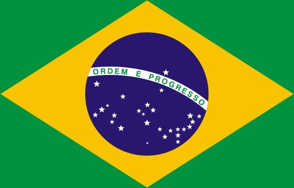
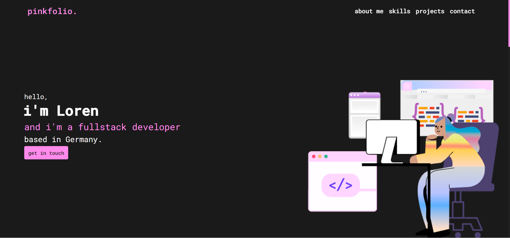

## PINKFOLIO

###### LER EM PORTUGUÊS: <kbd></kbd>  

 This website was built back in 2021 when I was relearning html, css and javascript. 

  
##### CHECK IT WORKING HERE: <a href="http://pinkfolio.graysse.com" target="_blank"> Pinkfolio Website </a>  

  

### 📑 ABOUT THE WEBSITE
This project was initially my own portfolio idea but, I stopped studying because I had to work and had no time to work on it, I mean, it's not even really responsive tho xd but for sure I'll still make some improvements on this one, it's a cute project! Maybe I'll turn it a free template for people who needs a simple portfolio website and don't want to create one from scratch. 

This website has only one page which is divided by sections. They are:  
- about me.  
- skills.  
- projects.  
- contact.

### 💻 USED TECHNOLOGIES
On this website I worked with:  
- HTML5.
- CSS3.
- Javascript.

### 📚 WHAT DID I LEARN
I'm not really sure what did I learn building this project since it's been a while I build it but, I'm sure I was trying to learn responsiveness. Not that I'm a pro nowadays but certainly I'm better than before xd. Responsiveness was and still is one of my weaknesses ... I'm a perfectionist person so I really struggle on finding the best breakpoints and the best element sizes for each breakpoint, but I never give up!

### 🔏 LICENSE

This project is under license. Check it out [LICENSE](LICENSE) for more details. 

##

[☝🏽 back to top](#pinkfolio)
